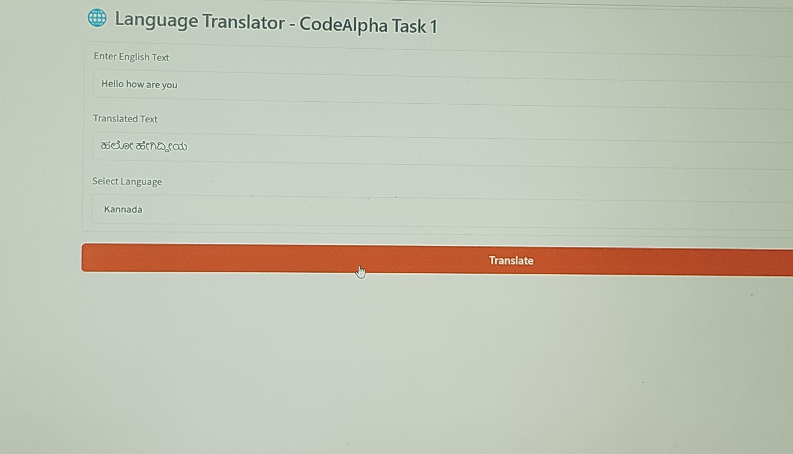
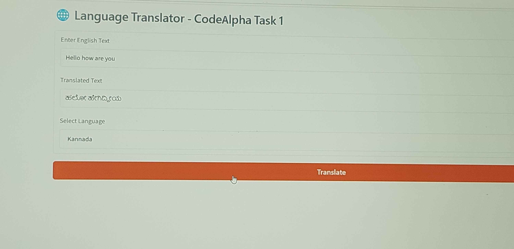

# 🌐 Language Translator - CodeAlpha Task 1

AI Internship Task 1 - Language Translation Tool

### Features
- Translate English to Hindi, Kannada, Tamil, Telugu, Malayalam, French, Spanish, German
- Built with Python, Gradio, deep_translator
- Simple Web UI

### How to Run
pip install gradio deep_translator
python translator.py

### Demo
Input: Hello how are you
Output: नमस्ते, आप कैसे हैं (Hindi)

Built for CodeAlpha AI Internship
#codealpha #python #ai #internship
### Output

